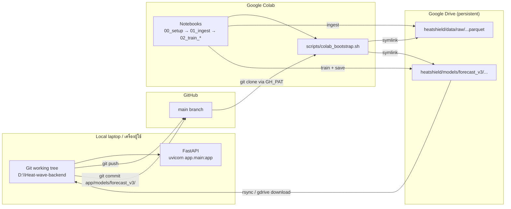

# Colab Training / เทรนโมเดลบน Colab

> **EN.** Operational guide for training HeatShield v3 forecasters on Google Colab while keeping FastAPI inference local.
>
> **TH.** คู่มือใช้งานสำหรับเทรนโมเดล HeatShield v3 บน Google Colab โดยที่ส่วน inference (FastAPI) ยังรันบนเครื่อง local เหมือนเดิม.

## 1. Architecture / สถาปัตยกรรม

**EN.** Colab is the training compute, Drive is the persistent volume, GitHub is the canonical source of truth, and the local laptop runs both the API and the eventual `app/models/forecast_v3/` artifacts under git.

**TH.** Colab ทำหน้าที่เทรน, Drive เก็บข้อมูล/โมเดลแบบถาวร, GitHub เป็นแหล่งโค้ดหลัก, และเครื่อง local ใช้รัน API พร้อม commit `app/models/forecast_v3/` เข้า git.



## 2. Required Colab secrets / Secrets ที่ต้องตั้งใน Colab

Set via the key icon in the Colab sidebar (Tools → Secrets) / ตั้งผ่านไอคอนกุญแจในแถบด้านข้างของ Colab.

| Secret | EN | TH | Required? |
|--------|----|----|-----------|
| `GH_PAT` | GitHub fine-grained PAT, scope: read repo. Used to clone the private repo from `colab_bootstrap.sh`. | Token GitHub (อ่าน repo). ใช้ตอน clone repo ใน bootstrap. | Yes / จำเป็น |
| `CDSAPI_KEY` | Climate Data Store API key for ERA5 reanalysis. Written to `~/.cdsapirc` by `01_ingest.ipynb`. | คีย์ CDS API สำหรับ ERA5. notebook จะเขียนลง `~/.cdsapirc` ให้. | Only if ingesting ERA5 / เฉพาะใช้ ERA5 |
| `TMD_API_KEY` | Thai Meteorological Department API key for live station data. | คีย์ API ของกรมอุตุฯ สำหรับข้อมูลสถานีปัจจุบัน. | Only if ingesting TMD / เฉพาะใช้ TMD |

> Never commit these values. The bootstrap reads them via `userdata.get(...)` and exports them as env vars only for the active runtime.

## 3. Drive folder layout / โครงสร้างโฟลเดอร์บน Drive

```text
/MyDrive/heatshield/
├── data/
│   ├── raw/
│   │   └── station_id={BKK_01,...}/date=YYYY-MM-DD/obs.parquet
│   └── cache/        # ad-hoc CDS / NASA POWER request cache
├── models/
│   └── forecast_v3/
│       └── {station_id}/h{H}/
│           ├── bundle.json       # backend-owned
│           └── registry.json     # registry sidecar (do not clobber)
└── logs/             # training logs, optuna trial dumps
```

**EN.** The bootstrap symlinks `data/` and `app/models/forecast_v3/` from the cloned repo to Drive so notebooks read/write the persistent volume transparently. The registry layout intentionally matches `app/ml/registry.py` (v3 contract) — `bundle.json` is backend-owned (e.g. `lightgbm_quantile`, `xgboost`, `tabpfn`); `registry.json` is the registry sidecar (don't merge them, see `CLAUDE.md`).

**TH.** Bootstrap จะ symlink `data/` กับ `app/models/forecast_v3/` จาก repo ที่ clone ลง Drive เพื่อให้ notebook อ่าน/เขียน volume ถาวรได้โดยอัตโนมัติ. โครงสร้างนี้ตรงกับ v3 contract ใน `app/ml/registry.py`: `bundle.json` เป็นของ backend (เช่น `lightgbm_quantile`, `xgboost`, `tabpfn`), ส่วน `registry.json` เป็น sidecar — อย่ารวมไฟล์สองตัวนี้ (ดู `CLAUDE.md`).

## 4. Recovery / ถ้า Colab timeout กลางคัน

**EN.** Colab session limits (12 h free, 24 h Pro) mean training can be interrupted. Mitigations:

1. Each `02_train_*.ipynb` writes intermediate artifacts to Drive **per (station, horizon)**. A timeout loses only the in-flight pair, not the whole sweep.
2. On reconnect, re-run cells 1–3 of `00_setup.ipynb` (idempotent), then re-run the training cell — it skips `(station, horizon)` pairs that already have a `bundle.json` unless `--force` is passed.
3. Optuna studies persist to `logs/optuna/{study}.db` in Drive; resume by passing the same `study_name` and `storage` URL.
4. If the runtime hits an OOM, drop the `--trials` count or restrict to one `station_id` and rerun.
5. As a last resort, download the partial Drive artifacts to local and finish training there.

**TH.** Colab จำกัดเวลา session (ฟรี 12 ชม., Pro 24 ชม.) ทำให้เทรนอาจถูกตัด. วิธีรับมือ:

1. notebook ทุกตัวเซฟ artifact ลง Drive **ต่อ (สถานี, horizon)** — ถ้าโดนตัดจะเสียแค่คู่ที่กำลังเทรน ไม่ใช่ทั้งหมด.
2. กลับเข้ามาใหม่ให้รัน cell 1–3 ของ `00_setup.ipynb` ใหม่ (idempotent) แล้วรัน cell train ต่อ — `(station, horizon)` ที่มี `bundle.json` แล้วจะถูกข้าม เว้นแต่ใส่ `--force`.
3. study ของ Optuna จะถูกเก็บที่ `logs/optuna/{study}.db` บน Drive; resume ได้ด้วย `study_name` และ `storage` URL เดิม.
4. ถ้า OOM ลด `--trials` หรือจำกัดไว้แค่ `station_id` เดียวแล้วรันใหม่.
5. ทางเลือกสุดท้าย: download artifact บางส่วนกลับลง local แล้วเทรนต่อบนเครื่องตัวเอง.

## 5. Push-back workflow: Drive → repo → `app/models/forecast_v3/`

**EN.** Models trained in Colab are not committed automatically. Bring them home like this:

1. **Locally**, mount Drive (e.g. via [`rclone`](https://rclone.org/drive/) or Google Drive for Desktop) so `~/HeatShieldDrive/heatshield/models/forecast_v3` is browsable.
2. Sync only the artifacts you want to ship:
   ```powershell
   # PowerShell — copy a single station+horizon
   $src = "$env:USERPROFILE\HeatShieldDrive\heatshield\models\forecast_v3\BKK_01\h24"
   $dst = "D:\Heat-wave-backend\app\models\forecast_v3\BKK_01\h24"
   robocopy $src $dst /MIR
   ```
3. Verify the v3 layout:
   ```powershell
   python -c "from app.ml.registry import load_latest_v3; print(load_latest_v3('BKK_01', 24))"
   ```
4. Update `app/models/forecast_v3/choice_matrix.json` if you switched the chosen backend for a `(station, horizon)` pair.
5. `git add app/models/forecast_v3/...` (use precise paths — never `git add -A`), commit, push.
6. Restart the local API: it pre-warms v3 forecasters on startup (`app/main.py`).

**TH.** โมเดลที่เทรนบน Colab จะไม่ถูก commit อัตโนมัติ — ต้องดึงกลับเอง:

1. ที่เครื่อง local mount Drive (เช่น ใช้ [`rclone`](https://rclone.org/drive/) หรือ Google Drive for Desktop) ให้เห็นโฟลเดอร์ `~/HeatShieldDrive/heatshield/models/forecast_v3` ได้.
2. sync เฉพาะ artifact ที่จะใช้:
   ```powershell
   # PowerShell — คัดลอกเฉพาะสถานี+horizon ที่ต้องการ
   $src = "$env:USERPROFILE\HeatShieldDrive\heatshield\models\forecast_v3\BKK_01\h24"
   $dst = "D:\Heat-wave-backend\app\models\forecast_v3\BKK_01\h24"
   robocopy $src $dst /MIR
   ```
3. ตรวจ layout v3:
   ```powershell
   python -c "from app.ml.registry import load_latest_v3; print(load_latest_v3('BKK_01', 24))"
   ```
4. แก้ `app/models/forecast_v3/choice_matrix.json` ถ้าเปลี่ยน backend ที่เลือกของ `(station, horizon)` ใดๆ.
5. `git add app/models/forecast_v3/...` (ระบุ path ตรงๆ — อย่าใช้ `git add -A`), commit, push.
6. restart API บนเครื่อง local: startup hook จะ pre-warm v3 forecaster ให้เอง (`app/main.py`).

## 6. Sanity checklist before merging artifacts / เช็คก่อน merge

- `bundle.json` is present and parseable / มีและ parse ได้.
- `registry.json` references the same backend name as `choice_matrix.json` / ค่า backend ตรงกัน.
- Validation metrics in `bundle.json` ≤ baseline (don't regress) / metric ไม่แย่กว่ารุ่นเก่า.
- `pytest -m slow` still passes locally / ทดสอบ slow suite ผ่าน.
- The model directory size is sane (<200 MB per `(station, horizon)`) / ขนาดโฟลเดอร์ไม่เกิน 200 MB ต่อคู่.
